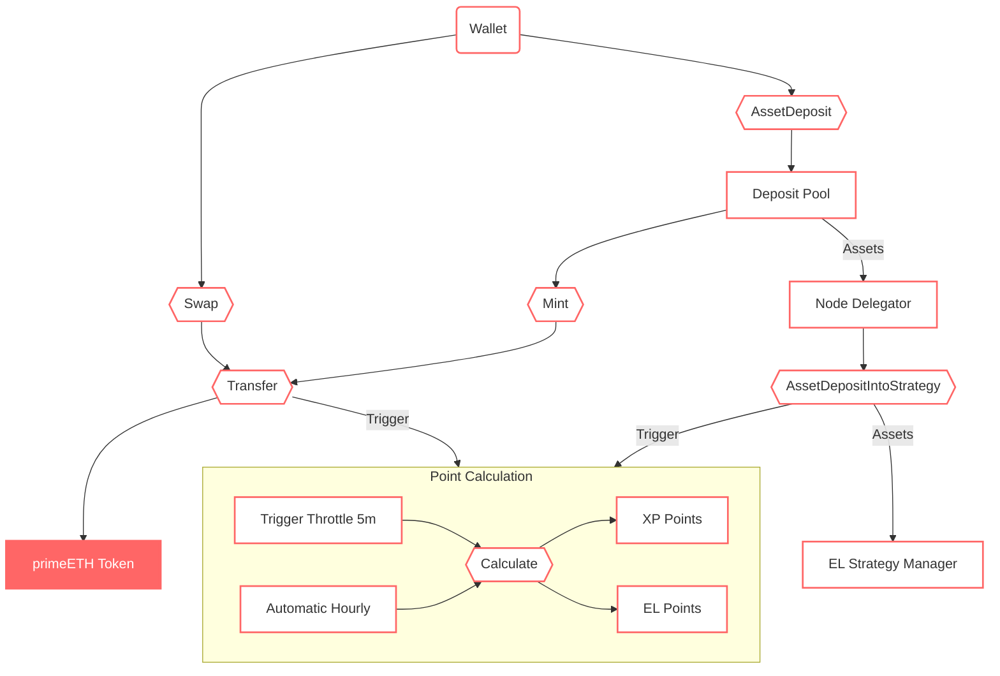

```mermaid
graph TD
    %% Entities
    W(Wallet)
    LDP[Deposit Pool]
    T[primeETH Token]:::inverse
    ND[Node Delegator]
    SM[EL Strategy Manager]
    
    %% Events
    SW{{Swap}}
    LDP_AD{{AssetDeposit}}
    T_M{{Mint}}
    T_T{{Transfer}}
    ND_ADIS{{AssetDepositIntoStrategy}}
    
    %% Flow
    W --> SW
    SW --> T_T
    T_T --> T
    W --> LDP_AD
    LDP_AD --> LDP
    LDP --> T_M
    T_M --> T_T
    LDP -->|Assets| ND
    ND --> ND_ADIS
    ND_ADIS -->|Assets| SM

    T_T -->|Trigger| P
    ND_ADIS -->|Trigger| P
    
    subgraph P[Point Calculation]
        P_T[Trigger Throttle 5m]
        P_T --> P_C{{Calculate}}
        P_HOUR[Automatic Hourly] --> P_C
        P_C --> P_XP[XP Points]
        P_C --> P_EL[EL Points]
    end

    classDef default fill:#fff,stroke:#ff6666,stroke-width:2px;
    classDef inverse fill:#ff6666,stroke:#ff6666,stroke-width:4px,color:#fff
```
